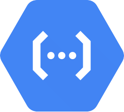

  <h1>
     Cookiecutter API Examples 
  </h1>

Examples generated using the [Cookiecutter API](https://github.com/Code-and-Sorts/cookiecutter-api) template.

## Examples

<table width="100%">
  <tr>
    <th width="10%" rowspan="2"></th>
    <td width="30%" align="center"> Azure</td>
    <td width="30%" align="center"> AWS</td>
    <td width="30%" align="center"> GCP</td>
  </tr>
  <tr>
    <td align="center"> Function App</td>
    <td align="center"> Lambda</td>
    <td align="center"> Cloud Function</td>
  </tr>
  <tr>
    <td align="center"></td>
    <td align="center"><a href="https://github.com/Code-and-Sorts/cookiecutter-api-examples/tree/python/azure-function-app">🔗</a></td>
    <td align="center"><a href="https://github.com/Code-and-Sorts/cookiecutter-api-examples/tree/python/aws-lambda">🔗</a></td>
    <td align="center"><a href="https://github.com/Code-and-Sorts/cookiecutter-api-examples/tree/python/gcp-cloud-function">🔗</a></td>
  </tr>
  <tr>
    <td align="center"></td>
    <td align="center"><a href="https://github.com/Code-and-Sorts/cookiecutter-api-examples/tree/typescript-nodejs/azure-function-app">🔗</a></td>
    <td align="center"><a href="https://github.com/Code-and-Sorts/cookiecutter-api-examples/tree/typescript-nodejs/aws-lambda">🔗</a></td>
    <td align="center"><a href="https://github.com/Code-and-Sorts/cookiecutter-api-examples/tree/typescript-nodejs/gcp-cloud-function">🔗</a></td>
  </tr>
  <tr>
    <td align="center"></td>
    <td align="center"><a href="https://github.com/Code-and-Sorts/cookiecutter-api-examples/tree/dotnet/azure-function-app">🔗</a></td>
    <td align="center"><a href="https://github.com/Code-and-Sorts/cookiecutter-api-examples/tree/dotnet/aws-lambda">🔗</a></td>
    <td align="center"><a href="https://github.com/Code-and-Sorts/cookiecutter-api-examples/tree/dotnet/gcp-cloud-function">🔗</a></td>
  </tr>
  <tr>
    <td align="center"></td>
    <td align="center"><a href="https://github.com/Code-and-Sorts/cookiecutter-api-examples/tree/golang/azure-function-app">🔗</a></td>
    <td align="center"><a href="https://github.com/Code-and-Sorts/cookiecutter-api-examples/tree/golang/aws-lambda">🔗</a></td>
    <td align="center"><a href="https://github.com/Code-and-Sorts/cookiecutter-api-examples/tree/golang/gcp-cloud-function">🔗</a></td>
  </tr>
</table>
